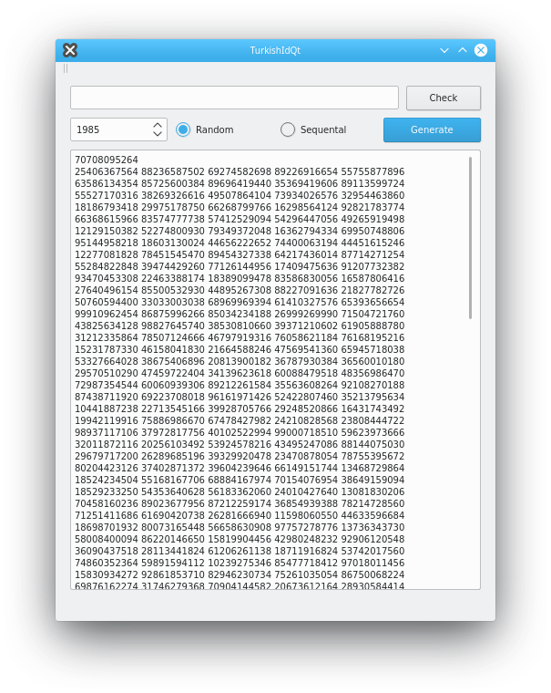

# TurkishIdQt

A validator and generator for Turkish Identification Numbers (TC Kimlik No)

## TODO

* Ability to verify multiple numbers at the same time instead of just one at a time
* A more optimized way to display created numbers
* Finding numbers of relatives
* Find missing digits of a given number
* Investigate other hidden features of algorithm
